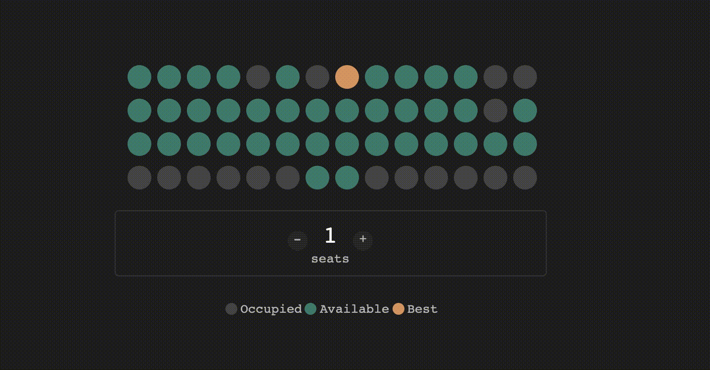

# README



To run this application

```
$ npm install
```
```
$ bundle install
```
```
# starts the rails application and then run the UI application.
$ npm start
``` 


To run tests (Jest)

```
$ npm test
```

To run lint (ESLint)

```
$npm run lint
``` 

NOTE: the client application expects the UI application to run at localhost:3000

To change venue information edit [this file.](public/venues/1.json)

ruby version : 2.6.3
node version : 12.13.1


TODO
* Enforce Prop Types
* Improve Code Coverage
* Improve JS Doc
* Fix Linting Errors

